 
# Large-Scale Sporting Venue Experience Enhancement System - Requirements Document
 
## Executive Summary
 
This document outlines comprehensive requirements for a digital solution designed to revolutionize the attendee experience at large-scale sporting venues (50,000+ capacity). The system addresses critical pain points including crowd congestion, excessive waiting times, navigation challenges, and lack of real-time coordination through an integrated mobile-first platform with IoT sensors, AI-powered analytics, and venue management tools.
 
**Target Venues:** Stadiums, arenas, and outdoor sporting complexes with 50,000-150,000+ capacity
**Primary Users:** Event attendees, venue staff, operations managers, vendors, security personnel
**Core Objectives:**
- Reduce average wait times by 40-60%
- Improve crowd flow efficiency by 50%+
- Enhance attendee satisfaction scores by 30%+
- Increase venue operational efficiency by 35%+
 
---
 
## 📊 Problem Statement & Metrics
 
### Current Pain Points at Large Venues
 
**Attendee Challenges:**
- **Entry/Exit Bottlenecks:** 30-45 minute wait times during peak entry (gates open to event start)
- **Concession Delays:** 15-25 minute average wait at food/beverage stands during halftime/breaks
- **Restroom Queues:** 10-20 minute waits during peak periods
- **Navigation Issues:** 40% of first-time attendees report difficulty finding seats, amenities
- **Parking Chaos:** 20-40 minute delays exiting parking areas post-event
- **Information Gap:** Limited real-time updates on wait times, alternate options, or event details
 
**Venue Operations Challenges:**
- **Reactive Management:** Staff unaware of congestion until complaints arise
- **Resource Allocation:** Inability to dynamically reassign staff to high-demand areas
- **Revenue Loss:** Long lines discourage purchases (estimated 15-20% lost concession revenue)
- **Safety Risks:** Uncontrolled crowd surges, emergency evacuation complications
- **Data Blindness:** Lack of analytics on attendee behavior, flow patterns, peak times
 
### Success Metrics (Target Goals)
 
| Metric | Current State | Target State | Measurement Method |
|--------|---------------|--------------|-------------------|
| Average Entry Time | 30-45 min | 10-15 min | Gate scan timestamps |
| Concession Wait Time | 15-25 min | 5-8 min | Queue sensors + transaction logs |
| Restroom Wait Time | 10-20 min | 3-5 min | Occupancy sensors + user reports |
| Navigation Assistance Usage | N/A | 70%+ adoption | App analytics |
| Attendee Satisfaction (NPS) | 45-55 | 70-80 | Post-event surveys |
| Operational Cost per Event | Baseline | -20% | Financial tracking |
| Concession Revenue per Capita | Baseline | +25% | POS system data |
| Emergency Response Time | 8-12 min | 3-5 min | Incident logs |
 
---
 
## 🎯 System Scope & Objectives
 
### In Scope
 
**Phase 1: Core Experience Platform (MVP)**
- Mobile application (iOS, Android) for attendees
- Real-time crowd density monitoring and visualization
- Smart navigation with AR wayfinding
- Live wait time estimation for concessions, restrooms, entry gates
- Digital ticketing integration with QR/NFC
- Push notifications for personalized alerts
- Basic venue map with amenities
 
**Phase 2: Operational Intelligence**
- Venue operations dashboard (web-based)
- Predictive analytics for crowd flow
- Staff coordination and dispatch system
- Heatmap visualization of venue activity
- Automated alerts for congestion/incidents
- Integration with POS systems
- Parking management system
 
**Phase 3: Enhanced Features**
- Mobile ordering for concessions (pre-order, pick-up)
- Seat upgrade marketplace
- Social features (friend finder, meet-up coordination)
- Gamification and loyalty rewards
- Multi-language support
- Accessibility features for disabled attendees
- Integration with public transportation APIs
 
**Phase 4: Advanced Intelligence**
- AI-powered demand forecasting
- Dynamic pricing for amenities
- Personalized recommendations
- Contactless payment integration
- Post-event analytics and reporting
- Integration with smart venue infrastructure (IoT)
 
### Out of Scope
 
- Ticketing sales platform (integrate with existing systems)
- Content streaming or live game footage
- Social media platform features (sharing to existing platforms only)
- Venue construction or physical infrastructure changes
- Third-party vendor management systems (integration only)
- Player/team statistics and game analysis tools
 
---
 
## 👥 User Personas & Use Cases
 
### Persona 1: Sarah - The Casual Fan (Primary User)
 
**Demographics:**
- Age: 28, Marketing professional
- Tech-savvy, smartphone power user
- Attends 3-5 events per year
- Usually brings friends/family
 
**Goals:**
- Enjoy the event without logistical stress
- Minimize time spent waiting in lines
- Find amenities quickly (restrooms, food, merchandise)
- Stay updated on event happenings
 
**Pain Points:**
- Anxiety about missing game action while waiting
- Frustration with unclear signage
- FOMO when friends at event have better experiences
 
**Use Cases:**
- UC-1: Navigate from parking to seat using AR guidance
- UC-2: Check restroom wait times and find nearest available
- UC-3: Pre-order food for halftime pickup
- UC-4: Receive alert when crowd clears for easier exit
- UC-5: Locate friends in the venue using friend-finder
 
### Persona 2: Marcus - The Season Ticket Holder (Power User)
 
**Demographics:**
- Age: 45, Business owner
- Attends 20+ events per year
- Knows venue layout well
- Often entertains clients
 
**Goals:**
- VIP/premium experience efficiency
- Quick access to preferred amenities
- Insider information and perks
- Seamless client entertainment
 
**Pain Points:**
- Even premium areas have wait times
- Wants exclusive benefits for loyalty
- Needs reliable information to impress clients
 
**Use Cases:**
- UC-6: Access VIP-only features and express lanes
- UC-7: Reserve premium parking and receive navigation
- UC-8: Get predictive alerts before crowds form
- UC-9: View historical data to plan arrival/departure
- UC-10: Earn and redeem loyalty rewards
 
### Persona 3: Jennifer - Venue Operations Manager (Admin User)
 
**Demographics:**
- Age: 38, 12 years venue management experience
- Oversees 200+ staff per event
- Responsible for attendee satisfaction and safety
- Data-driven decision maker
 
**Goals:**
- Optimize staff allocation in real-time
- Prevent safety incidents from overcrowding
- Maximize revenue per attendee
- Gather actionable insights for future events
 
**Pain Points:**
- Limited visibility into real-time conditions
- Slow communication with distributed staff
- Reactive problem-solving instead of proactive
- Difficulty proving ROI of operational changes
 
**Use Cases:**
- UC-11: Monitor live crowd density heatmaps
- UC-12: Dispatch staff to emerging bottlenecks
- UC-13: Receive automated alerts for safety thresholds
- UC-14: Analyze post-event reports for optimization
- UC-15: Forecast demand for upcoming events
 
### Persona 4: David - Security & Safety Officer (Operator)
 
**Demographics:**
- Age: 35, Former law enforcement
- Manages security team of 50-80 personnel
- Primary concern: attendee safety
- Needs rapid incident response
 
**Goals:**
- Maintain safe crowd density levels
- Quick response to emergencies
- Clear evacuation routes
- Real-time communication with team
 
**Pain Points:**
- Blind spots in venue coverage
- Delayed incident reporting
- Coordination challenges across large areas
- Emergency evacuation complexity
 
**Use Cases:**
- UC-16: Monitor restricted area access
- UC-17: Track security personnel locations
- UC-18: Receive instant alerts for unusual crowd patterns
- UC-19: Coordinate emergency evacuation procedures
- UC-20: Review incident footage and timeline
 
### Persona 5: Alex - Concession Vendor Staff (End User)
 
**Demographics:**
- Age: 22, Part-time college student
- Works 5-10 events per season
- Limited training time
- High-pressure environment during peaks
 
**Goals:**
- Serve customers efficiently
- Minimize order errors
- Understand peak demand timing
- Receive support when needed
 
**Pain Points:**
- Overwhelmed during rush periods
- Lack of prep time warning
- Unclear when to call for backup
- Frustrated customers from long waits
 
**Use Cases:**
- UC-21: Receive advance warning of incoming crowd surge
- UC-22: Request management assistance with one tap
- UC-23: View real-time inventory levels
- UC-24: Access mobile order queue
- UC-25: Report equipment issues instantly
 
---
 
## 🏗️ System Architecture Overview

```mermaid
graph TB
    subgraph "Attendee Layer"
        A1[Mobile App - iOS]
        A2[Mobile App - Android]
        A3[Progressive Web App]
        A4[Kiosks]
    end
   
    subgraph "Operations Layer"
        B1[Venue Dashboard]
        B2[Staff Mobile App]
        B3[Security Console]
        B4[Analytics Portal]
    end
   
    subgraph "API Gateway & Services"
        C1[API Gateway]
        C2[Authentication Service]
        C3[Real-time Service]
        C4[Notification Service]
        C5[Analytics Service]
        C6[Navigation Service]
        C7[Ordering Service]
        C8[Payment Service]
    end
   
    subgraph "Data & Intelligence"
        D1[User Database]
        D2[Event Database]
        D3[Sensor Data Lake]
        D4[ML Models]
        D5[Cache Layer]
        D6[Message Queue]
    end
   
    subgraph "IoT & Integration Layer"
        E1[Crowd Sensors]
        E2[Gate Scanners]
        E3[POS Systems]
        E4[Parking Systems]
        E5[WiFi Analytics]
        E6[Camera Systems]
        E7[Ticketing APIs]
        E8[Payment Gateways]
    end
   
    A1 --> C1
    A2 --> C1
    A3 --> C1
    A4 --> C1
   
    B1 --> C1
    B2 --> C1
    B3 --> C1
    B4 --> C1
   
    C1 --> C2
    C1 --> C3
    C1 --> C4
    C1 --> C5
    C1 --> C6
    C1 --> C7
    C1 --> C8
   
    C2 --> D1
    C3 --> D5
    C3 --> D6
    C5 --> D3
    C5 --> D4
    C6 --> D2
    C7 --> D2
   
    E1 --> D3
    E2 --> D3
    E3 --> C7
    E4 --> C6
    E5 --> D3
    E6 --> D3
    E7 --> C2
    E8 --> C8
```
 

 
### Component Responsibilities
 
**Attendee Layer:**
- Native mobile apps for optimal performance and user experience
- PWA for web access without app installation
- Self-service kiosks at venue entry points
 
**Operations Layer:**
- Real-time dashboards for venue management
- Mobile apps for distributed staff coordination
- Specialized consoles for security operations
- Analytics portal for strategic planning
 
**API Gateway & Services:**
- Centralized API gateway for security, rate limiting, routing
- Microservices architecture for scalability
- Real-time WebSocket connections for live updates
- Independent service scaling based on demand
 
**Data & Intelligence:**
- Multi-database architecture (relational + NoSQL + time-series)
- ML models for predictive analytics
- Redis cache for high-frequency data
- Message queue for asynchronous processing
 
**IoT & Integration:**
- Sensors for crowd counting, occupancy detection
- Integration with existing venue systems
- Camera analytics for flow monitoring
- External API connections
 
---
 
## 📱 Functional Requirements - Attendee Mobile App
 
### FR-1: User Authentication & Profiles
 
**FR-1.1: Account Creation**
- Users can register using email, phone, or social login (Google, Apple, Facebook)
- Email/phone verification required before first use
- Profile creation: name, photo, preferences, accessibility needs
- Terms of service and privacy policy acceptance
 
**FR-1.2: Ticket Linking**
- Users can link digital tickets via QR code scan, email forward, or manual entry
- Support for multiple tickets (family/group purchases)
- Integration with major ticketing platforms (Ticketmaster, AXS, SeatGeek, etc.)
- Automatic event detection and profile creation
 
**FR-1.3: Profile Management**
- Edit personal information, notification preferences
- Manage payment methods (credit cards, digital wallets)
- Set dietary restrictions, accessibility requirements
- View purchase history and loyalty points
 
**FR-1.4: Session Management**
- Secure token-based authentication
- Biometric login (FaceID, TouchID, fingerprint)
- Auto-logout after 30 days of inactivity
- Multi-device support with session visibility
 
### FR-2: Real-Time Navigation & Wayfinding
 
**FR-2.1: Interactive Venue Map**
- 3D venue map with zoom, pan, rotate capabilities
- Color-coded sections (seating, concessions, restrooms, exits, first aid)
- User location indicator (blue dot) using GPS + indoor positioning (WiFi/BLE)
- Section/row/seat highlighting based on user's ticket
- Accessibility route options (elevators, ramps, accessible restrooms)
 
**FR-2.2: Search & Discovery**
- Search for amenities: "nearest restroom," "gluten-free food," "ATM"
- Filter by type: food, drinks, merchandise, services
- View amenity details: hours, menu, wait times, availability
- Favorites/bookmarking for quick access
 
**FR-2.3: Turn-by-Turn Navigation**
- Route planning from current location to destination
- Step-by-step directions with distance and time estimates
- Alternate routes displayed if primary is congested
- Visual + text directions
- Mid-route recalculation if user deviates
 
**FR-2.4: AR Wayfinding**
- Camera overlay with directional arrows
- POI markers visible through camera view
- Gate/section numbers highlighted in real-world view
- Distance indicators to destinations
- Works in outdoor and indoor areas
 
**FR-2.5: Parking Integration**
- Parking spot saving (GPS coordinates + photo)
- Navigation from seat back to car
- Parking lot occupancy levels
- Optimal exit route suggestions based on traffic
 
### FR-3: Crowd & Wait Time Intelligence
 
**FR-3.1: Real-Time Wait Times**
- Estimated wait times for all concession stands, restrooms, merchandise stores
- Color-coded indicators: Green (<5 min), Yellow (5-10 min), Red (>10 min)
- Historical accuracy tracking and display
- Update frequency: every 30-60 seconds
 
**FR-3.2: Crowd Density Visualization**
- Heatmap overlay on venue map showing crowd concentration
- Density levels: Low, Moderate, High, Very High
- Predictions for crowd movement (e.g., "High traffic expected at Gate 4 in 15 min")
- Alternative route suggestions to avoid congestion
 
**FR-3.3: Smart Recommendations**
- "Best time to visit restroom" based on game flow prediction
- Suggest less crowded alternative amenities
- Optimal timing for food pickup (before rush)
- Personalized based on user location and preferences
 
**FR-3.4: Queue Management**
- Virtual queue joining for select high-demand locations
- Place in line indicator with estimated wait
- Notification when it's time to head to location
- QR code for queue verification
 
### FR-4: Mobile Ordering & Pickup
 
**FR-4.1: Browse Menus**
- View menus for all concession stands
- Filter by dietary needs (vegetarian, vegan, gluten-free, kosher, halal)
- View photos, descriptions, prices, calories
- See availability status (in stock / sold out)
- Vendor ratings and popular items highlighted
 
**FR-4.2: Order Placement**
- Add items to cart with customizations
- Apply discounts, loyalty points, promo codes
- Select pickup location and time window
- Order total calculation with taxes
- Secure checkout with saved payment methods
 
**FR-4.3: Order Tracking**
- Order confirmation with order number
- Real-time status updates: Received → Preparing → Ready
- Push notifications for status changes
- Estimated pickup time
- QR code for order pickup verification
 
**FR-4.4: Pickup Process**
- Navigation to designated pickup location
- "I'm here" button to alert vendor
- Order ready notification
- Express pickup lanes for mobile orders
- Order history and reordering
 
**FR-4.5: In-Seat Delivery (Premium)**
- Option for in-seat delivery for premium ticket holders
- Delivery time slot selection
- Real-time delivery tracking
- Delivery person identification
- Tip option post-delivery
 
### FR-5: Notifications & Alerts
 
**FR-5.1: Personalized Event Updates**
- Event start time reminders (configurable: 24h, 2h, 30min before)
- Gate opening notifications
- Parking lot opening alerts
- Weather updates for outdoor venues
- Line-up changes, pre-game ceremonies
 
**FR-5.2: Operational Alerts**
- Gate closure warnings
- Facility issues (restroom out of service)
- Security alerts and instructions
- Lost child alerts (opt-in system)
- Emergency evacuation procedures
 
**FR-5.3: Smart Suggestions**
- "Good time to grab food" (low crowd periods)
- "Restrooms near you have no wait"
- "Upgrade your seat" (available seat marketplace)
- "Your favorite vendor has a special offer"
- "Traffic clearing - good time to exit"
 
**FR-5.4: Social Notifications**
- Friend check-ins at venue
- Group meet-up coordination
- Social event invitations
- Shared photo/video notifications
 
**FR-5.5: Notification Management**
- Granular notification preferences by type
- Do Not Disturb mode during game play
- Notification history view
- Critical alerts override DND
 
### FR-6: Social Features & Coordination
 
**FR-6.1: Friend Finder**
- Connect with contacts attending same event
- Privacy-controlled location sharing (always, event-only, off)
- See friends' approximate locations on venue map
- "Meet me at" location sharing with navigation
- Group creation for families/friend groups
 
**FR-6.2: Group Coordination**
- Create groups with shared features
- Group chat messaging
- Shared orders (split payments)
- Coordinated seating view
- Group notifications
 
**FR-6.3: Check-In & Sharing**
- Check in to venue/event on social platforms
- Share photos/videos directly from app
- Tag friends in photos
- View event social feed (opt-in)
- Privacy controls for sharing
 
### FR-7: Tickets & Entry
 
**FR-7.1: Digital Tickets**
- Display tickets with QR codes / barcodes
- NFC-enabled contactless entry
- Animated tickets to prevent screenshots/forgery
- Offline ticket access (cached)
- Multi-ticket view for group leaders
 
**FR-7.2: Ticket Transfer**
- Transfer tickets to other users via email/phone
- Accept/decline ticket transfers
- Transfer limits (24 hours before event)
- Audit trail for transfers
 
**FR-7.3: Seat Upgrades**
- View available upgraded seats
- Purchase upgrades during event (subject to availability)
- Instant ticket update with new seat location
- Price comparison and seat view previews
- Upgrade recommendations based on availability
 
**FR-7.4: Express Entry**
- Fast-track entry lanes for app users with pre-verified tickets
- Entry time booking/reservation (staggered entry)
- Entry gate recommendations based on current traffic
- Bag policy checker and reminders
 
### FR-8: Loyalty & Rewards
 
**FR-8.1: Points System**
- Earn points for check-ins, purchases, referrals, reviews
- Point balance display and history
- Redemption options: discounts, merchandise, seat upgrades
- Tier status: Bronze, Silver, Gold, Platinum
- Tier benefits and progress tracking
 
**FR-8.2: Gamification**
- Achievements and badges (first visit, 10 events attended, etc.)
- Challenges: "Visit 3 different concessions," "Share on social"
- Leaderboards (opt-in)
- Exclusive rewards for top users
- Seasonal competitions
 
**FR-8.3: Personalized Offers**
- Birthday specials and anniversary rewards
- Favorite team/venue targeted promotions
- Time-sensitive flash offers during event
- Partner offers (local restaurants, hotels, transportation)
- Referral bonuses
 
### FR-9: Accessibility Features
 
**FR-9.1: Assistive Technology Support**
- VoiceOver/TalkBack compatibility
- High contrast mode
- Adjustable text sizing
- Haptic feedback for navigation cues
- Screen reader optimized UI
 
**FR-9.2: Accessibility Navigation**
- Accessible route planning (elevators, ramps, wider paths)
- Wheelchair accessible restroom locations
- Companion seating information
- Accessible parking spot navigation
- Service animal accommodation info
 
**FR-9.3: Sensory Accommodations**
- Quiet zones and sensory-friendly areas
- Hearing assistance device availability
- Visual alert options (replace audio alerts)
- Closed captioning for video content
- Descriptive audio for venue features
 
**FR-9.4: Language Support**
- Multi-language interface (English, Spanish, French, German, Chinese, Japanese, Korean, Arabic)
- Real-time translation for announcements
- Multilingual staff location finder
- Cultural accommodation information (prayer rooms, dietary options)
 
### FR-10: Help & Support
 
**FR-10.1: In-App Support**
- FAQ and help articles
- Searchable help center
- Video tutorials for key features
- Venue-specific information and policies
 
**FR-10.2: Live Assistance**
- In-app chat with venue staff
- Request staff assistance to location
- Report issues (cleanliness, safety, lost items)
- Emergency contact button
- Callback request system
 
**FR-10.3: Feedback System**
- Rate experience components (entry, concessions, cleanliness)
- Submit detailed feedback with photos
- Report inappropriate behavior
- Suggestion box for improvements
- Follow-up on submitted issues
 
---
 
## 🖥️ Functional Requirements - Venue Operations Dashboard
 
### FR-11: Real-Time Monitoring
 
**FR-11.1: Live Crowd Heatmap**
- Color-coded venue overview showing crowd density by zone
- Drill-down capability to specific sections/areas
- Occupancy percentage vs. capacity
- Historical comparison overlay (same time previous events)
- Predictive overlay (expected density in 15/30/60 minutes)
- Customizable alert thresholds per zone
 
**FR-11.2: Wait Time Dashboard**
- Grid view of all amenities with current wait times
- Trend graphs (increasing/decreasing/stable)
- Longest wait alerts
- Comparison to target SLA metrics
- Staff-to-demand ratio indicators
- Revenue impact estimates from wait times
 
**FR-11.3: Entry/Exit Monitoring**
- Real-time entry rates per gate
- Total attendees entered vs. expected
- Gate efficiency metrics (scans per minute)
- Exit flow monitoring and bottleneck detection
- Predicted exit completion time
- Parking exit queue visualization
 
**FR-11.4: Facility Status Board**
- Restroom occupancy levels
- Out-of-service facilities tracking
- Maintenance request status
- Cleaning schedule and completion
- Inventory levels (paper products, soap)
- Automated alerts for issues
 
**FR-11.5: System Health Monitoring**
- IoT sensor status (online/offline/degraded)
- Network connectivity status
- App usage metrics (active users, feature usage)
- API performance and error rates
- Database and server health
- Integration status with external systems
 
### FR-12: Predictive Analytics
 
**FR-12.1: Demand Forecasting**
- Machine learning models predict demand by location and time
- Concession demand forecast by vendor
- Restroom peak time predictions
- Entry/exit surge timing
- Weather impact analysis for outdoor venues
- Event-type based pattern recognition
 
**FR-12.2: Scenario Planning**
- "What-if" analysis tools
- Staff allocation optimization suggestions
- Resource requirement calculators
- Revenue optimization scenarios
- Capacity planning for sold-out events
- Emergency scenario simulations
 
**FR-12.3: Historical Analytics**
- Event comparison tools
- Trend analysis over seasons
- Attendee behavior patterns
- Revenue per event type
- Efficiency metric tracking over time
- Benchmarking against industry standards
 
### FR-13: Staff Management & Dispatch
 
**FR-13.1: Staff Tracking**
- Real-time location of staff members (with privacy controls)
- Staff role and assignment visibility
- Check-in/check-out tracking
- Break and shift scheduling
- Staff-to-zone assignment view
- Coverage gap identification
 
**FR-13.2: Dynamic Dispatch**
- One-click staff reassignment to high-need areas
- Automated dispatch suggestions based on demand
- Staff acknowledgment of assignments
- Estimated time to arrival
- Task completion confirmation
- Priority queue for urgent issues
 
**FR-13.3: Communication Hub**
- Broadcast messages to all staff or specific teams
- Two-way messaging with individual staff
- Pre-set message templates for common scenarios
- Emergency alert broadcasting
- Read receipts and acknowledgments
- Group channels by department/zone
 
**FR-13.4: Performance Tracking**
- Staff response time metrics
- Task completion rates
- Customer feedback correlation
- Top performer identification
- Training needs identification
- Scheduling optimization recommendations
 
### FR-14: Incident Management
 
**FR-14.1: Incident Reporting**
- Quick incident creation (type, location, severity)
- Photo/video attachment capability
- Automatic timestamp and reporter ID
- Pre-defined incident categories
- Assignment to appropriate responder
- Escalation rules based on severity/time
 
**FR-14.2: Incident Tracking**
- Live incident status board
- Time-to-resolution tracking
- Resource allocation to incidents
- Communication log for each incident
- Resolution notes and outcomes
- Post-incident review flagging
 
**FR-14.3: Security Integration**
- Security camera feed access (with permissions)
- Suspicious activity alerts
- Restricted area breach notifications
- Crowd surge warnings
- Integration with security personnel radios
- Emergency services coordination
 
**FR-14.4: Medical Emergency Response**
- Medical incident location highlighting
- Nearest medical staff/equipment locator
- AED location mapping
- First responder dispatch
- Communication with EMS
- Patient tracking to exit/ambulance
 
### FR-15: Revenue & Business Intelligence
 
**FR-15.1: Real-Time Revenue Dashboard**
- Live concession sales by vendor
- Revenue per capita tracking
- Comparison to forecasts and targets
- Peak sales period identification
- Payment method breakdown
- Mobile order vs. in-person ratios
 
**FR-15.2: Inventory Management**
- Stock levels by vendor
- Sell-through rates
- Out-of-stock alerts
- Replenishment recommendations
- Waste tracking
- Popular item identification
 
**FR-15.3: Customer Behavior Analytics**
- Dwell time analysis
- Path analysis (common routes)
- Amenity usage patterns
- Conversion rates (app users who purchase)
- Repeat visit identification
- Segment analysis (by ticket type, demographics)
 
**FR-15.4: Post-Event Reporting**
- Comprehensive event summary reports
- KPI achievement dashboard
- Comparative analysis to previous events
- Highlight reel of key moments
- Areas for improvement identification
- Exportable reports (PDF, Excel, PPT)
 
### FR-16: Configuration & Administration
 
**FR-16.1: Venue Configuration**
- Upload/edit venue maps and layouts
- Define zones and their capacities
- Set amenity locations and details
- Configure entry/exit gates
- Parking area mapping
- Accessibility feature mapping
 
**FR-16.2: Event Setup**
- Create event profiles (date, time, expected attendance)
- Configure event-specific settings
- Set dynamic pricing rules
- Define staffing requirements
- Activate/deactivate features per event
- Clone settings from similar past events
 
**FR-16.3: Threshold Management**
- Set alert thresholds for crowd density
- Configure wait time SLAs
- Define security alert criteria
- Customize notification rules
- Set escalation policies
- A/B testing framework for optimizations
 
**FR-16.4: User & Permission Management**
- Add/remove dashboard users
- Role-based access control (admin, manager, operator, viewer)
- Audit log of administrative actions
- API key management for integrations
- Staff profile management
- Training module assignment
 
**FR-16.5: Integration Management**
- Configure ticketing system integrations
- POS system connection settings
- Payment gateway configuration
- Third-party API credentials
- Webhook management
- Data export/import tools
 
---
 
## 🔧 Non-Functional Requirements
 
### NFR-1: Performance
 
**NFR-1.1: Response Time**
- API response time: < 200ms for 95th percentile
- Mobile app startup: < 2 seconds on modern devices
- Map rendering: < 1 second for initial load
- Real-time updates: < 500ms latency from sensor to display
- Search results: < 300ms
- Navigation route calculation: < 1 second
 
**NFR-1.2: Scalability**
- Support 100,000+ concurrent users per venue
- Handle 1 million+ API requests per hour during peak
- Database queries maintain performance with 10M+ records
- Horizontal scaling capability for all services
- Auto-scaling based on load (CPU, memory, request rate)
- Graceful degradation under extreme load
 
**NFR-1.3: Throughput**
- Process 10,000+ sensor updates per second
- Handle 5,000+ concurrent mobile orders
- Support 500+ concurrent dashboard users
- Process 20,000+ push notifications per minute
- Real-time data pipeline: < 2 second end-to-end latency
 
### NFR-2: Reliability & Availability
 
**NFR-2.1: Uptime**
- 99.9% uptime SLA (< 9 hours downtime per year)
- 99.99% uptime during event hours (< 5 minutes per month)
- Planned maintenance only during non-event periods
- Redundant systems for critical components
- No single point of failure
 
**NFR-2.2: Fault Tolerance**
- Automatic failover for critical services (< 30 second switchover)
- Circuit breakers for external dependencies
- Queue-based processing for non-critical operations
- Retry logic with exponential backoff
- Database replication with automatic failover
 
**NFR-2.3: Disaster Recovery**
- Recovery Time Objective (RTO): < 4 hours
- Recovery Point Objective (RPO): < 15 minutes
- Regular backup schedule: Full daily, incremental hourly
- Multi-region deployment capability
- Tested disaster recovery procedures quarterly
 
**NFR-2.4: Data Integrity**
- ACID compliance for transactional data
- Data validation at API layer
- Checksums for critical data transfers
- Audit trails for all data modifications
- Data consistency checks and automated repair
 
### NFR-3: Security
 
**NFR-3.1: Authentication & Authorization**
- Multi-factor authentication for admin users
- OAuth 2.0 and OpenID Connect support
- JWT-based token authentication
- Role-based access control (RBAC)
- Principle of least privilege
- Session timeout: 30 minutes inactivity for admin, 30 days for mobile
 
**NFR-3.2: Data Protection**
- Encryption at rest: AES-256
- Encryption in transit: TLS 1.3
- PCI DSS compliance for payment data
- Tokenization of sensitive data
- Secure key management (HSM or cloud KMS)
- Data masking in logs and non-production environments
 
**NFR-3.3: Privacy**
- GDPR, CCPA, and PIPEDA compliance
- User consent management
- Right to be forgotten implementation
- Data minimization principles
- Privacy by design
- Anonymous usage analytics option
 
**NFR-3.4: Network Security**
- Web Application Firewall (WAF)
- DDoS protection (Cloudflare, AWS Shield, or similar)
- Intrusion Detection/Prevention System (IDS/IPS)
- Regular vulnerability scanning (weekly)
- Penetration testing (annual)
- API rate limiting and throttling
 
**NFR-3.5: Application Security**
- Secure coding practices (OWASP Top 10)
- Input validation and sanitization
- SQL injection prevention (parameterized queries)
- XSS prevention
- CSRF protection
- Dependency vulnerability scanning (automated)
 
**NFR-3.6: Compliance & Auditing**
- SOC 2 Type II compliance
- Comprehensive audit logging
- Log retention: 7 years for transactions, 90 days for operational
- Security incident response plan
- Regular security training for development team
- Third-party security audits (annual)
 
### NFR-4: Usability
 
**NFR-4.1: Mobile App Usability**
- Intuitive navigation requiring < 3 taps for primary tasks
- Consistent UI patterns following iOS HIG and Material Design
- Minimum touch target size: 44x44 pixels (iOS), 48x48dp (Android)
- User testing with target personas (5 users per iteration)
- Accessibility compliance: WCAG 2.1 Level AA
- Onboarding tutorial completing in < 90 seconds
 
**NFR-4.2: Dashboard Usability**
- Single-screen visibility for critical metrics (no scrolling needed on 1920x1080)
- Color-blind friendly color schemes
- < 5 minute learning curve for basic operations
- Keyboard shortcuts for power users
- Responsive design supporting tablets and large displays
- Customizable dashboard layouts
 
**NFR-4.3: Error Handling**
- User-friendly error messages (no technical jargon)
- Actionable recovery instructions
- Graceful degradation when features unavailable
- Offline mode for critical mobile app features
- Clear loading indicators and progress bars
- Retry mechanisms with user control
 
### NFR-5: Compatibility
 
**NFR-5.1: Mobile Platform Support**
- iOS: Latest 2 major versions (iOS 16, 17)
- Android: API Level 26+ (Android 8.0+)
- Device support: 95% of active devices in target markets
- Screen sizes: 4.7" to 12.9" tablets
- Orientation: Portrait and landscape
- Dark mode support
 
**NFR-5.2: Browser Compatibility**
- Chrome (latest 2 versions)
- Safari (latest 2 versions)
- Firefox (latest 2 versions)
- Edge (latest 2 versions)
- Minimum resolution: 1280x720
- Progressive Web App support
 
**NFR-5.3: Integration Compatibility**
- RESTful API with OpenAPI 3.0 specification
- Webhook support for event notifications
- GraphQL API for flexible data queries (optional)
- SDK/libraries for iOS, Android, JavaScript
- Backward compatible API versioning
- Documented deprecation policy (6 months notice)
 
**NFR-5.4: Third-Party Integrations**
- Ticketing: Ticketmaster, AXS, SeatGeek, Eventbrite, Paciolan
- Payment: Stripe, Square, PayPal, Apple Pay, Google Pay
- Mapping: Google Maps, Apple Maps, Mapbox
- Analytics: Google Analytics, Mixpanel, Amplitude
- CRM: Salesforce, HubSpot
- POS: Oracle Micros, NCR, Toast
 
### NFR-6: Maintainability
 
**NFR-6.1: Code Quality**
- Code coverage: minimum 80% unit tests, 60% integration tests
- Linting and static analysis (ESLint, SonarQube)
- Peer review required for all code changes
- Documented coding standards
- Automated code quality gates in CI/CD
- Technical debt tracking and remediation plans
 
**NFR-6.2: Documentation**
- API documentation auto-generated from code
- Architecture decision records (ADRs)
- Runbooks for operational procedures
- User manuals and training materials
- Inline code comments for complex logic
- Up-to-date README files for all repositories
 
**NFR-6.3: Monitoring & Observability**
- Application Performance Monitoring (APM)
- Distributed tracing for microservices
- Centralized logging with search capability
- Custom business metrics dashboards
- Alerting for anomalies and SLA breaches
- On-call rotation and escalation procedures
 
**NFR-6.4: DevOps**
- Infrastructure as Code (Terraform, CloudFormation)
- Automated CI/CD pipelines
- Blue-green or canary deployment strategies
- Automated rollback capability
- Environment parity (dev, staging, production)
- Feature flags for gradual rollouts
 
### NFR-7: Localization & Internationalization
 
**NFR-7.1: Language Support**
- Primary: English (US)
- Secondary: Spanish, French, German, Chinese (Simplified), Japanese, Korean, Arabic
- Unicode (UTF-8) support throughout
- Right-to-left (RTL) language support
- Locale-specific date, time, number, currency formats
- Translation management system integration
 
**NFR-7.2: Regional Adaptations**
- Timezone handling and display
- Currency conversion and display
- Metric vs. imperial units
- Regional payment method support
- Compliance with local regulations
- Cultural sensitivity in content and imagery
 
### NFR-8: Operational Requirements
 
**NFR-8.1: Deployment**
- Containerized deployment (Docker/Kubernetes)
- Cloud-agnostic architecture (AWS, Azure, GCP compatible)
- Multi-region deployment capability
- Automated deployment scripts
- Zero-downtime deployment
- Environment promotion automation (dev → staging → production)
 
**NFR-8.2: Monitoring & Alerting**
- 24/7 system monitoring
- Automated alerts via PagerDuty/OpsGenie
- Real-time dashboards (Grafana/Datadog)
- SLA monitoring and reporting
- Capacity planning alerts (80% threshold warnings)
- Cost monitoring and optimization alerts
 
**NFR-8.3: Support & Operations**
- 24/7 on-call support during events
- Business hours support (9am-6pm local) for non-events
- < 15 minute response time for P0 incidents during events
- < 1 hour response time for P1 incidents
- Dedicated support channels (Slack, phone, email)
- Incident post-mortems within 48 hours
 
---
 
## 🌐 IoT & Sensor Requirements
 
### SR-1: Crowd Density Sensors
 
**SR-1.1: Sensor Types**
- WiFi probe request detection (passive monitoring)
- Bluetooth Low Energy (BLE) beacon triangulation
- Computer vision cameras with people counting algorithms
- Infrared beam counters at entry/exit points
- Pressure-sensitive floor mats in high-traffic areas
- LiDAR sensors for 3D crowd mapping
 
**SR-1.2: Coverage Requirements**
- Sensor placement every 20-30 feet in high-traffic zones
- 100% coverage of entry/exit points
- Redundant sensors in critical areas (overlapping coverage)
- Vertical coverage for multi-level venues
- Outdoor and indoor capable sensors
- Weather-resistant for outdoor installations
 
**SR-1.3: Data Specifications**
- Update frequency: 5-10 second intervals
- Accuracy: ±5% for crowd counts < 100, ±10% for > 100
- Resolution: Individual zone counts (10x10 meter grids)
- Data format: JSON over MQTT or HTTP
- Unique device identifiers (anonymized MAC addresses)
- Battery life: 6 months minimum for wireless sensors
 
**SR-1.4: Privacy & Compliance**
- No personally identifiable information (PII) collected
- MAC address randomization handling
- Data anonymization before storage
- Clear signage about monitoring
- Opt-out mechanism via app settings
- GDPR and CCPA compliant data handling
 
### SR-2: Queue & Wait Time Sensors
 
**SR-2.1: Occupancy Sensors**
- Restroom door sensors (open/closed/locked status)
- Occupancy counters (people in vs. out)
- Stall-level occupancy detection
- Line length estimation via camera analytics
- Time-stamped entry/exit events
 
**SR-2.2: Point-of-Sale Integration**
- Transaction timestamps from POS systems
- Order completion times
- Service time per customer calculation
- Queue length from order management systems
- Capacity utilization metrics
 
**SR-2.3: Wait Time Calculation**
- Historical average service times
- Current queue length
- Staff availability factor
- Time-of-day adjustment factors
- Event phase adjustments (pre-game, halftime, post-game)
- Real-time recalculation every 30-60 seconds
 
### SR-3: Environmental Sensors
 
**SR-3.1: Comfort Monitoring**
- Temperature sensors (indoor and outdoor)
- Humidity sensors
- Air quality sensors (CO2, particulate matter)
- Noise level monitors
- Lighting sensors (for adaptive displays)
 
**SR-3.2: Safety Sensors**
- Smoke and fire detectors integration
- Emergency exit status monitors
- Panic button/call box locations
- Water leak detectors (restrooms, concession areas)
- Electrical fault monitors
 
### SR-4: Parking Sensors
 
**SR-4.1: Parking Space Detection**
- Magnetic or ultrasonic sensors per space
- Camera-based license plate recognition (LPR)
- Occupancy status per space
- Aggregated availability by zone/level
- Reserved space monitoring (VIP, accessible)
 
**SR-4.2: Traffic Flow**
- Entry/exit gate throughput monitoring
- Queue length at entry/exit
- Average entry/exit times
- License plate matching (entry to exit)
- Payment status integration
 
### SR-5: Network Infrastructure
 
**SR-5.1: WiFi Connectivity**
- High-density WiFi access points (1 AP per 100-150 users)
- 5GHz and 6GHz band support (WiFi 6E)
- Minimum 10 Mbps per user
- Seamless roaming between APs
- Captive portal with terms acceptance
- Public + private network segmentation
 
**SR-5.2: Cellular Coverage**
- DAS (Distributed Antenna System) or small cells
- Support for all major carriers
- 4G LTE and 5G coverage
- Minimum signal strength: -85 dBm
- Capacity: 100,000+ simultaneous connections
- Backhaul capacity: 10+ Gbps
 
**SR-5.3: IoT Network**
- Dedicated IoT network (LoRaWAN, Zigbee, or private LTE)
- Separate from public WiFi for reliability
- Mesh network capability for redundancy
- Low-power consumption for battery sensors
- Secure device provisioning and authentication
 
---
 
## 🔗 Integration Requirements
 
### INT-1: Ticketing Platform Integration
 
**INT-1.1: Supported Platforms**
- Ticketmaster (Host API, Presence API)
- AXS (AXS API)
- SeatGeek (SeatGeek API v2)
- Eventbrite (Eventbrite API v3)
- Paciolan (Paciolan API)
- Custom venue ticketing systems (via adapter pattern)
 
**INT-1.2: Data Exchange**
- Ticket validation and authentication
- Attendee check-in status
- Seat location and section details
- Ticket holder information (with consent)
- Transfer and resale tracking
- Season ticket holder identification
 
**INT-1.3: Real-Time Sync**
- Ticket status updates (used, voided, transferred)
- Entry scan events
- Capacity tracking
- VIP/premium ticket identification
- Group ticket associations
 
### INT-2: Payment Processing Integration
 
**INT-2.1: Payment Gateways**
- Stripe (primary)
- Square (alternative)
- PayPal/Venmo
- Apple Pay (via Stripe or native)
- Google Pay (via Stripe or native)
- Gift cards and venue-specific stored value
 
**INT-2.2: PCI Compliance**
- No credit card data storage (tokenization only)
- PCI DSS Level 1 certified payment partners
- 3D Secure (3DS) support for card-not-present transactions
- Fraud detection integration
- Chargeback handling procedures
 
**INT-2.3: Transaction Features**
- Split payments for group orders
- Tipping for delivery/service
- Refund and void processing
- Receipt generation and email
- Payment method management (add, remove, update)
- Pre-authorization for account credit
 
### INT-3: Point-of-Sale (POS) Integration
 
**INT-3.1: POS Systems**
- Oracle Micros Simphony
- NCR Aloha
- Toast POS
- Square POS
- Clover
- Custom venue POS systems
 
**INT-3.2: Data Synchronization**
- Menu items, pricing, modifiers
- Inventory levels
- Sales transactions
- Order status updates
- Employee/terminal identification
- Shift and reconciliation data
 
**INT-3.3: Mobile Order Flow**
- Order submission from app to POS
- Order acknowledgment and confirmation
- Preparation status updates
- Payment confirmation
- Order ready notification trigger
- Loyalty point application
 
### INT-4: CRM & Marketing Integration
 
**INT-4.1: CRM Platforms**
- Salesforce (SFDC API)
- HubSpot (HubSpot API)
- Custom venue CRM systems
- Email service providers (SendGrid, Mailchimp)
- SMS providers (Twilio, MessageBird)
 
**INT-4.2: Data Synchronization**
- Attendee profile creation/updates
- Purchase history and behavioral data
- Loyalty program enrollment and points
- Marketing preferences and consent
- Segmentation tags
- Campaign engagement tracking
 
**INT-4.3: Personalization Data**
- Event attendance history
- Favorite concession items
- Spending patterns
- Social media connections
- Referral source tracking
- NPS and satisfaction scores
 
### INT-5: Security & Access Control
 
**INT-5.1: Physical Security Integration**
- Access control systems (HID, SALTO, Brivo)
- Security camera systems (Genetec, Milestone, Verkada)
- Intercom and PA systems
- Emergency response systems
- Security guard dispatch systems
 
**INT-5.2: Data Sharing**
- Restricted area access logs
- Badge/credential validation
- Visitor management
- Incident reporting integration
- Emergency alert broadcasting
- Video retrieval for incidents
 
### INT-6: Transportation & Parking
 
**INT-6.1: Parking Management**
- Parking reservation systems (ParkWhiz, SpotHero)
- License plate recognition (LPR) systems
- Parking guidance systems (INDECT, Amano)
- Payment kiosks and gates
- Validation systems
 
**INT-6.2: Public Transportation**
- Transit APIs (GTFS, transit agency APIs)
- Real-time arrival information
- Route planning
- Service alerts
- Special event shuttles
 
**INT-6.3: Ride-Sharing**
- Uber (Uber Rides API)
- Lyft (Lyft API)
- Designated pickup/dropoff zone information
- Price estimation
- Deep links to apps
 
### INT-7: Weather & External Data
 
**INT-7.1: Weather Services**
- Weather API (OpenWeatherMap, Weather.com)
- Real-time conditions and forecasts
- Severe weather alerts
- Lightning detection (for outdoor venues)
- Temperature and precipitation data
 
**INT-7.2: Emergency Services**
- Local emergency alert systems
- Public safety networks
- Hospital/EMS coordination systems
- Alert notification systems (IPAWS, Wireless Emergency Alerts)
 
### INT-8: Analytics & Business Intelligence
 
**INT-8.1: Analytics Platforms**
- Google Analytics (GA4)
- Mixpanel (event tracking)
- Amplitude (product analytics)
- Tableau/PowerBI (business intelligence)
- Custom data warehouses (Snowflake, BigQuery, Redshift)
 
**INT-8.2: Data Export**
- Scheduled data exports (daily, weekly, monthly)
- Real-time event streaming
- API access for ad-hoc queries
- Standardized data formats (CSV, JSON, Parquet)
- Data retention policies and archiving
 
---
 
## 🗄️ Data Requirements
 
### DR-1: Data Models
 
**DR-1.1: User Data**
```
User:
- userId (UUID, PK)
- email (unique, indexed)
- phoneNumber (unique, optional)
- firstName, lastName
- profilePhoto (URL)
- accountCreatedDate (timestamp)
- lastLoginDate (timestamp)
- preferredLanguage (ISO 639-1)
- accessibilityPreferences (JSON)
- notificationPreferences (JSON)
- privacySettings (JSON)
- loyaltyTier (enum: Bronze, Silver, Gold, Platinum)
- loyaltyPoints (integer)
 
PaymentMethod:
- paymentMethodId (UUID, PK)
- userId (FK)
- type (enum: credit_card, debit_card, apple_pay, google_pay)
- token (string, encrypted)
- lastFour (string)
- expiryMonth, expiryYear
- isDefault (boolean)
- createdDate (timestamp)
 
UserTicket:
- ticketId (UUID, PK)
- userId (FK)
- eventId (FK)
- sectionId (FK)
- ticketingSystemId (string)
- barcode (string, encrypted)
- seatLocation (string: section-row-seat)
- ticketType (enum: standard, premium, VIP, accessible)
- purchaseDate (timestamp)
- entryTime (timestamp, nullable)
- status (enum: active, used, transferred, cancelled)
```
 
**DR-1.2: Venue & Event Data**
```
Venue:
- venueId (UUID, PK)
- name (string)
- address (JSON)
- capacity (integer)
- venueType (enum: stadium, arena, outdoor)
- timezone (IANA timezone)
- mapData (JSON/GeoJSON)
- configuration (JSON)
- wifiSSID (string)
- contactInfo (JSON)
 
Event:
- eventId (UUID, PK)
- venueId (FK)
- name (string)
- eventType (enum: sports, concert, conference)
- eventDate (date)
- startTime, endTime (timestamp)
- expectedAttendance (integer)
- actualAttendance (integer, updated real-time)
- status (enum: scheduled, in_progress, completed, cancelled)
- weatherForecast (JSON)
- specialInstructions (text)
 
Section:
- sectionId (UUID, PK)
- venueId (FK)
- sectionName (string: e.g., "Section 101", "Club Level")
- sectionType (enum: standard, premium, VIP, accessible, standing)
- capacity (integer)
- priceZone (string)
- amenities (JSON array)
- coordinates (GeoJSON polygon)
```
 
**DR-1.3: Amenity Data**
```
Amenity:
- amenityId (UUID, PK)
- venueId (FK)
- name (string)
- type (enum: concession, restroom, merchandise, first_aid, ATM, info_booth)
- location (GeoJSON point)
- section (string)
- floor/level (integer)
- capacity (integer, for restrooms/seating)
- hours (JSON: opening/closing times)
- status (enum: open, closed, limited, out_of_service)
- features (JSON: e.g., gluten_free, vegetarian, accessible)
- menu (JSON, for concessions)
 
MenuItem:
- menuItemId (UUID, PK)
- amenityId (FK)
- name (string)
- description (text)
- price (decimal)
- category (string: food, beverage, merchandise)
- dietary (array: vegetarian, vegan, gluten_free, kosher, halal)
- allergens (array)
- calories (integer, optional)
- imageURL (string)
- availability (boolean)
- prepTime (integer, seconds)
```
 
**DR-1.4: Real-Time Operational Data**
```
CrowdDensity:
- recordId (UUID, PK)
- eventId (FK)
- zoneId (FK)
- timestamp (timestamp, indexed)
- personCount (integer)
- density (float: persons per sq meter)
- velocityVector (JSON: speed, direction)
- alertLevel (enum: normal, moderate, high, critical)
 
WaitTime:
- recordId (UUID, PK)
- eventId (FK)
- amenityId (FK)
- timestamp (timestamp, indexed)
- estimatedWaitMinutes (integer)
- queueLength (integer)
- serviceRate (float: customers per minute)
- accuracy (float: 0-1)
- predictionConfidence (float: 0-1)
 
SensorData:
- sensorId (UUID, PK)
- sensorType (enum: wifi, ble, camera, ir_beam, pressure, occupancy)
- location (GeoJSON point)
- timestamp (timestamp, indexed)
- rawData (JSONB)
- processedData (JSONB)
- batteryLevel (integer, 0-100, nullable)
- status (enum: online, offline, degraded)
```
 
**DR-1.5: Transaction Data**
```
Order:
- orderId (UUID, PK)
- userId (FK)
- eventId (FK)
- amenityId (FK)
- orderNumber (string, human-readable)
- orderType (enum: mobile_pickup, in_seat_delivery, will_call)
- items (JSON array of menuItemId + quantity + customizations)
- subtotal (decimal)
- tax (decimal)
- tip (decimal, nullable)
- total (decimal)
- paymentMethodId (FK)
- status (enum: pending, confirmed, preparing, ready, completed, cancelled)
- orderTime (timestamp)
- pickupTime (timestamp, nullable)
- completedTime (timestamp, nullable)
- pickupLocation (string)
- specialInstructions (text)
 
Transaction:
- transactionId (UUID, PK)
- orderId (FK)
- paymentToken (string)
- amount (decimal)
- currency (ISO 4217)
- status (enum: pending, authorized, captured, failed, refunded)
- gatewayResponse (JSON)
- timestamp (timestamp)
```
 
**DR-1.6: Analytics & Logs**
```
UserActivity:
- activityId (UUID, PK)
- userId (FK)
- eventId (FK, nullable)
- sessionId (UUID)
- activityType (enum: page_view, search, navigation, order, check_in)
- activityData (JSONB)
- timestamp (timestamp, indexed)
- deviceType (enum: iOS, Android, web)
- appVersion (string)
 
Incident:
- incidentId (UUID, PK)
- eventId (FK)
- reportedBy (userId or staffId, FK)
- incidentType (enum: medical, security, maintenance, lost_item, complaint)
- severity (enum: low, medium, high, critical)
- location (GeoJSON point)
- description (text)
- photoURLs (array of strings)
- assignedTo (staffId, FK, nullable)
- status (enum: reported, assigned, in_progress, resolved, closed)
- reportedTime (timestamp)
- resolvedTime (timestamp, nullable)
- resolutionNotes (text)
```
 
### DR-2: Data Volume Estimates
 
**Per Event (75,000 attendee capacity):**
- User profiles: 75,000 records (assuming unique attendees)
- User tickets: 75,000 records
- Crowd density data points: 500 zones × 720 measurements (2-hour event, 10-sec intervals) = 360,000 records
- Wait time data points: 100 amenities × 720 measurements = 72,000 records
- Sensor readings: 1,000 sensors × 720 readings = 720,000 records
- User activities: 75,000 users × 50 actions avg = 3,750,000 records
- Orders: 75,000 × 30% conversion × 1.5 orders avg = 33,750 records
- Transactions: ~35,000 records
 
**Annual Volume (50 events per venue):**
- User profiles: 1,000,000+ (with duplicates across events)
- Crowd density: 18,000,000 records
- Wait times: 3,600,000 records
- Sensor data: 36,000,000 records
- User activities: 187,500,000 records
- Orders: 1,687,500 records
 
**Multi-Venue Scale (100 venues):**
- Billions of sensor/activity records annually
- Requires data partitioning and archival strategies
- Time-series database for sensor data (InfluxDB, TimescaleDB)
- Hot/warm/cold storage tiers
 
### DR-3: Data Retention & Archival
 
**Retention Policies:**
- Real-time operational data (sensor, wait times): 90 days hot storage → 1 year warm → archive
- User activity logs: 1 year hot → 3 years warm → 7 years archive (compliance)
- Transaction data: 7 years (financial regulations)
- User profiles: Active until account deletion + 30 days
- Analytics aggregations: 5 years
- Incident reports: 7 years (liability)
- Video/photos: 30 days unless incident-related (7 years)
 
**Archival Strategy:**
- Automated archival jobs (weekly)
- Compressed storage (Parquet, ORC formats)
- Cold storage (AWS Glacier, Azure Archive)
- Restore capability within 24 hours
- GDPR-compliant deletion procedures
 
### DR-4: Data Privacy & Compliance
 
**Personal Data Handling:**
- Minimize PII collection (only necessary data)
- Explicit consent for optional data (location sharing, photos)
- Data encryption at rest and in transit
- Pseudonymization of analytics data
- Right to access (user data export API)
- Right to deletion (account deletion + data purge)
- Data portability (JSON export)
 
**Anonymization:**
- Sensor data: No MAC addresses stored, only hashed/anonymized IDs
- Analytics: Aggregate data only in reports
- Sharing with third parties: Only anonymized/aggregated data
- Research data sets: Fully anonymized and IRB-approved if needed
 
**Consent Management:**
- Granular consent options in app settings
- Consent version tracking
- Re-consent prompts on policy changes
- Audit trail of consent changes
- Easy withdrawal of consent
 
---
 
## 🧪 Testing Requirements
 
### TR-1: Unit Testing
 
**Coverage Requirements:**
- Minimum 80% code coverage for all services
- 100% coverage for critical paths (payments, authentication, safety features)
- All public APIs and functions must have tests
- Edge cases and error conditions tested
 
**Testing Frameworks:**
- Backend: Jest (Node.js), JUnit (Java), pytest (Python), xUnit (.NET)
- Frontend: Jest, React Testing Library, Enzyme
- Mobile: XCTest (iOS), Espresso/JUnit (Android)
 
**Test Categories:**
- Business logic validation
- Data transformation and validation
- Error handling and recovery
- Algorithm correctness (wait time calculation, routing)
 
### TR-2: Integration Testing
 
**API Integration Tests:**
- All API endpoints with various input combinations
- Authentication and authorization flows
- Database operations (CRUD)
- Third-party integration mocks
- Error responses and status codes
- Rate limiting and throttling
 
**Service Integration Tests:**
- Inter-service communication
- Message queue processing
- Cache behavior
- External API integrations (with mocks/stubs)
- Webhook delivery
 
**Database Integration Tests:**
- Complex queries with joins
- Transaction handling and rollback
- Concurrent access scenarios
- Data integrity constraints
- Migration scripts
 
### TR-3: End-to-End (E2E) Testing
 
**User Journeys:**
- Complete attendee flow: Download app → Register → Link ticket → Navigate venue → Order food → Check in
- Dashboard flow: Login → Monitor event → Dispatch staff → Resolve incident
- Payment flow: Add payment method → Place order → Confirm transaction → Receipt
- Emergency flow: Alert triggered → Staff notified → Incident resolved
 
**Testing Tools:**
- Web: Selenium, Playwright, Cypress
- Mobile: Appium, Detox (React Native), XCUITest (iOS), Espresso (Android)
- API: Postman, REST Assured
 
**Environments:**
- Dedicated E2E test environment
- Production-like data and configuration
- Automated nightly test runs
- Smoke tests on every deployment
 
### TR-4: Performance Testing
 
**Load Testing:**
- Simulate 100,000 concurrent users
- Ramp-up scenarios (gradual entry over 30 minutes)
- Sustained load for 3+ hours (typical event duration)
- Spike testing (sudden surge, e.g., halftime rush)
- Tools: Apache JMeter, Gatling, Locust, k6
 
**Stress Testing:**
- Push beyond expected capacity (150% of max)
- Identify breaking points
- Verify graceful degradation
- Monitor resource exhaustion points
 
**Endurance Testing:**
- 24-hour continuous load
- Detect memory leaks
- Monitor performance degradation over time
- Database connection pool behavior
 
**Benchmarking:**
- Establish baseline performance metrics
- Compare before/after optimization changes
- Track performance trends over releases
- Device-specific benchmarks (low-end vs. high-end phones)
 
### TR-5: Security Testing
 
**Vulnerability Scanning:**
- Automated weekly scans (OWASP ZAP, Burp Suite)
- Dependency vulnerability checks (Snyk, npm audit, Dependabot)
- Infrastructure scanning (Nessus, Qualys)
- Container image scanning (Trivy, Clair)
 
**Penetration Testing:**
- Annual third-party pen tests
- OWASP Top 10 verification
- API security testing
- Mobile app security (reverse engineering, data leakage)
- Social engineering tests (phishing simulations)
 
**Authentication Testing:**
- Token expiration and refresh
- Multi-factor authentication flows
- Session hijacking prevention
- Brute force protection
- Password strength enforcement
 
**Authorization Testing:**
- Role-based access control (RBAC) verification
- Privilege escalation attempts
- Cross-user data access prevention
- API endpoint authorization
 
### TR-6: Usability Testing
 
**Moderated User Testing:**
- 5 users per persona per iteration
- Task completion rate measurement
- Time-on-task tracking
- User satisfaction surveys (SUS, NPS)
- Think-aloud protocols
 
**A/B Testing:**
- UI variations for key flows
- Feature flag-based rollouts
- Statistical significance thresholds (95% confidence)
- Conversion rate optimization
- Tools: Optimizely, LaunchDarkly, Google Optimize
 
**Accessibility Testing:**
- Screen reader compatibility (VoiceOver, TalkBack, NVDA)
- Keyboard navigation
- Color contrast verification (WCAG AA/AAA)
- Touch target size validation
- Automated tools: Axe, WAVE, Lighthouse
 
**Beta Testing:**
- Closed beta: 500 users, 2 weeks before launch
- Open beta: 5,000 users, 1 week before launch
- In-app feedback mechanism
- Crash reporting and analytics
- Bug prioritization and fix verification
 
### TR-7: Disaster Recovery Testing
 
**Failover Testing:**
- Simulated server failures
- Database failover procedures
- Multi-region failover
- Load balancer failure scenarios
- Verify RTO and RPO targets
 
**Backup & Restore Testing:**
- Quarterly full restore drills
- Verify backup integrity
- Test restore procedures
- Measure restore time
- Data consistency validation
 
**Chaos Engineering:**
- Random service termination (Chaos Monkey)
- Network latency injection
- Resource exhaustion simulation
- Dependency failure testing
- Circuit breaker validation
 
---
 
## 📈 Success Criteria & KPIs
 
### KPI-1: Attendee Experience Metrics
 
**Primary Metrics:**
- **Wait Time Reduction:** Target 60% reduction in average wait times
  - Baseline: 15-25 min at concessions → Target: 5-8 min
  - Measurement: Sensor data + transaction timestamps
- **Net Promoter Score (NPS):** Target 70+ (from typical 45-55)
  - Measurement: Post-event survey via app
  - Sample size: Minimum 10% of attendees
- **App Adoption Rate:** Target 60% of attendees use app during event
  - Measurement: Unique active users per event / total attendance
- **Feature Utilization:** Target 75% of app users use core features (navigation, wait times, ordering)
  - Measurement: App analytics
 
**Secondary Metrics:**
- **Navigation Accuracy:** 95% of users reach destination without assistance
- **Order Accuracy:** 99% of mobile orders fulfilled correctly
- **App Rating:** 4.5+ stars on App Store and Google Play
- **Repeat Usage:** 70% of users who use app once use it again at next event
- **Friend Finder Usage:** 30% of attendees connect with friends in app
 
### KPI-2: Operational Efficiency Metrics
 
**Staff Productivity:**
- **Response Time:** Average time to respond to dispatched task < 5 minutes
- **Issue Resolution Time:** 80% of incidents resolved within 15 minutes
- **Staff-to-Attendee Ratio:** Reduce required staff by 15% while maintaining service levels
- **Overtime Reduction:** 20% reduction in overtime hours
 
**Resource Optimization:**
- **Concession Utilization:** Average queue utilization 70-85% (not under or overwhelmed)
- **Restroom Usage Balance:** No facility > 90% utilization while others < 50%
- **Staff Redeployment:** 30% of staff dynamically redeployed based on real-time needs
- **Inventory Accuracy:** 95% accuracy in predicting inventory needs (reduce waste)
 
**Safety & Compliance:**
- **Crowd Density Alerts:** Zero crowd density threshold breaches unnoticed
- **Emergency Response Time:** < 3 minutes for medical emergencies (from 8-12 min)
- **Incident Reporting:** 100% of incidents logged and tracked
- **Safety Audit Score:** 95+ on venue safety audits
 
### KPI-3: Business & Revenue Metrics
 
**Revenue Impact:**
- **Concession Revenue per Capita:** +25% increase
  - Baseline: $15-20 per attendee → Target: $19-25
  - Drivers: Reduced wait times → more purchases, mobile ordering convenience
- **Mobile Order Revenue:** 40% of concession sales via mobile by Year 2
- **Upsell Conversion:** 10% of users purchase seat upgrades or premium services
- **Sponsorship Revenue:** +$500K annually from app advertising/sponsorships
 
**Cost Savings:**
- **Operational Costs:** -20% reduction per event
  - Labor optimization, reduced waste, efficient resource allocation
- **Customer Service Costs:** -30% reduction in complaints and service requests
- **Lost & Found Processing:** -40% reduction in lost item reports (better navigation)
 
**Return on Investment (ROI):**
- **Payback Period:** 18-24 months
- **ROI Target:** 200% over 3 years
- **Cost per Attendee:** < $2 per attendee per event (all-in platform costs)
 
### KPI-4: Technical Performance Metrics
 
**System Performance:**
- **API Response Time:** P95 < 200ms, P99 < 500ms
- **App Crash Rate:** < 0.1% of sessions
- **System Uptime:** 99.9% overall, 99.99% during events
- **Error Rate:** < 0.5% of requests result in errors
- **Mobile App Load Time:** < 2 seconds on 4G/LTE
 
**Data Accuracy:**
- **Wait Time Prediction Accuracy:** ±2 minutes for 80% of predictions
- **Crowd Density Accuracy:** ±5% of actual counts (validated via gate scans)
- **Navigation Accuracy:** 95% of routes valid and optimal
- **Sensor Uptime:** 98% of sensors online during events
 
**Scalability:**
- **Concurrent Users:** Support 100,000+ without degradation
- **Peak Request Rate:** 50,000+ requests per second
- **Database Query Performance:** 99% of queries < 100ms
- **Auto-scaling Efficiency:** Scale from baseline to peak in < 5 minutes
 
### KPI-5: Adoption & Engagement Metrics
 
**User Acquisition:**
- **Download Rate:** 50% of ticket purchasers download app before event
- **Registration Rate:** 80% of downloads complete registration
- **Ticket Linking Rate:** 90% of registrations link tickets
- **New User Growth:** 20% month-over-month during season
 
**User Engagement:**
- **Daily Active Users (DAU) on Event Days:** 60% of attendees
- **Session Duration:** Average 20+ minutes during event
- **Sessions per Event:** 3+ sessions per user during event
- **Feature Engagement:** 50% of users engage with 3+ features
- **Social Feature Usage:** 25% use friend finder or check-in
 
**User Retention:**
- **Week 1 Retention:** 70% of users return to app within 7 days of first event
- **Season Retention:** 60% of users use app at 2+ events in season
- **Annual Retention:** 40% of users use app across multiple years
- **Churn Rate:** < 10% per season for active users
 
**User Satisfaction:**
- **Customer Satisfaction Score (CSAT):** 4.5/5.0 average
- **Feature Satisfaction:** 85% of users rate key features as "useful" or "very useful"
- **Recommendation Rate:** 70% would recommend app to friends
- **Support Ticket Volume:** < 1% of users submit support tickets per event
 
---
 
## 🚀 Implementation Plan
 
### Phase 1: Foundation & Core Platform (Months 1-4)
 
**Month 1: Project Setup & Design**
- [ ] Finalize technical architecture and technology stack
- [ ] Set up development, staging, and production environments
- [ ] Establish CI/CD pipelines and DevOps workflows
- [ ] Create detailed UI/UX designs and interactive prototypes
- [ ] Conduct usability testing on prototypes with 20+ users
- [ ] Finalize API specifications (OpenAPI documentation)
- [ ] Set up project management and communication tools
- [ ] Establish coding standards and documentation practices
- [ ] Security review and threat modeling
- [ ] Procurement: Begin IoT sensor and network infrastructure procurement
 
**Month 2-3: MVP Development - Attendee App**
- [ ] User authentication and profile management
- [ ] Ticket linking and digital ticket display
- [ ] Interactive venue map with basic navigation
- [ ] Real-time wait time display (basic version with manual updates)
- [ ] Push notifications framework
- [ ] Search and filter for amenities
- [ ] Basic mobile ordering (simple menu, checkout, order tracking)
- [ ] iOS and Android native app development
- [ ] Unit and integration testing (80% coverage minimum)
 
**Month 3-4: MVP Development - Operations Dashboard**
- [ ] Dashboard authentication and user management
- [ ] Live venue overview with manual data entry
- [ ] Staff management and assignment interface
- [ ] Incident reporting and tracking
- [ ] Basic analytics and reporting
- [ ] Real-time notifications for staff
- [ ] Web-based responsive interface
- [ ] Integration testing with attendee app
 
**Month 4: Pilot Event Preparation**
- [ ] Beta testing with 500 users at a non-critical event
- [ ] Performance testing and optimization
- [ ] Security audit and penetration testing
- [ ] Staff training on dashboard and procedures
- [ ] Marketing materials and attendee education campaign
- [ ] Support infrastructure setup (help desk, documentation)
- [ ] Pilot event: 10,000-20,000 attendee venue
- [ ] Post-pilot evaluation and iteration
 
**Deliverables:**
- ✅ Functional mobile app (iOS, Android) with core features
- ✅ Operations dashboard with monitoring and incident management
- ✅ Backend API and database infrastructure
- ✅ Successful pilot event with 50%+ app adoption
- ✅ Security and compliance certifications (PCI DSS)
 
---
 
### Phase 2: IoT Integration & Intelligence (Months 5-8)
 
**Month 5-6: IoT Sensor Deployment**
- [ ] Install crowd density sensors (WiFi, BLE, cameras)
- [ ] Deploy occupancy sensors for restrooms and queues
- [ ] Set up parking sensors and LPR systems
- [ ] Establish IoT network infrastructure (LoRaWAN/private LTE)
- [ ] Integrate sensor data pipelines into backend
- [ ] Real-time data visualization on dashboard
- [ ] Automated wait time calculation algorithms
- [ ] Crowd density heatmap generation
- [ ] Alert threshold configuration and testing
 
**Month 6-7: Predictive Analytics & ML Models**
- [ ] Collect baseline data from 5-10 events
- [ ] Develop demand forecasting models (concession, restroom traffic)
- [ ] Build crowd flow prediction algorithms
- [ ] Create wait time prediction models (ML-based)
- [ ] Implement anomaly detection for safety (unusual crowd patterns)
- [ ] Optimize navigation algorithms based on real-time density
- [ ] A/B testing framework for model improvements
- [ ] Model accuracy measurement and continuous improvement
 
**Month 7-8: Enhanced Operations Features**
- [ ] Automated staff dispatch recommendations
- [ ] Dynamic resource allocation algorithms
- [ ] Predictive maintenance alerts
- [ ] Advanced analytics dashboard with ML insights
- [ ] Historical trend analysis and event comparison
- [ ] Revenue optimization recommendations
- [ ] Capacity planning tools
- [ ] Integration with venue security systems (cameras, access control)
 
**Month 8: Full-Scale Launch**
- [ ] Deploy at 3-5 venue locations
- [ ] Comprehensive staff training program
- [ ] Full marketing campaign (email, social media, venue signage)
- [ ] 24/7 support team activation
- [ ] Real-time monitoring and incident response
- [ ] Post-event analysis and optimization
- [ ] User feedback collection and prioritization
- [ ] Performance benchmarking against KPIs
 
**Deliverables:**
- ✅ Fully automated real-time wait time and crowd monitoring
- ✅ Predictive analytics operational across all venues
- ✅ IoT sensor network deployed and operational
- ✅ 60%+ app adoption at launched venues
- ✅ 40% reduction in wait times demonstrated
 
---
 
### Phase 3: Advanced Features & Scale (Months 9-12)
 
**Month 9-10: Premium Features**
- [ ] AR wayfinding with camera overlay
- [ ] In-seat delivery for premium ticket holders
- [ ] Seat upgrade marketplace with real-time availability
- [ ] Social features: friend finder, meet-up coordination, check-ins
- [ ] Gamification: achievements, leaderboards, challenges
- [ ] Loyalty program with points and rewards
- [ ] Personalized recommendations engine
- [ ] Multi-language support (8 languages)
- [ ] Accessibility enhancements (voice control, high contrast)
 
**Month 10-11: Ecosystem Expansion**
- [ ] Partner integrations: ride-sharing (Uber, Lyft), transit APIs
- [ ] Third-party marketplace for merchandise and experiences
- [ ] Sponsorship and advertising platform
- [ ] White-label solution for other venues
- [ ] API marketplace for developers
- [ ] CRM and email marketing automation
- [ ] Advanced business intelligence and custom reporting
 
**Month 11-12: Optimization & Scale**
- [ ] Performance optimization for 150,000+ attendee venues
- [ ] Multi-region deployment for national/international venues
- [ ] Advanced AI features: personalized itineraries, chatbot support
- [ ] Blockchain-based ticketing integration (anti-fraud)
- [ ] Sustainability tracking (carbon footprint, waste reduction)
- [ ] Community features: forums, fan groups
- [ ] Post-event experiences: highlights, photos, social sharing
- [ ] Platform maturity: 99.99% uptime, <100ms response times
 
**Month 12: Comprehensive Evaluation**
- [ ] Full year performance review across all KPIs
- [ ] User satisfaction survey (10,000+ responses)
- [ ] ROI calculation and financial analysis
- [ ] Case studies and success stories
- [ ] Industry recognition and awards submissions
- [ ] Strategic planning for Year 2 roadmap
- [ ] Expand to 50+ venues (sales and onboarding)
 
**Deliverables:**
- ✅ Comprehensive feature set (AR, social, loyalty, premium services)
- ✅ Platform deployed at 20+ venues
- ✅ 70%+ attendee satisfaction (NPS)
- ✅ 25%+ increase in venue revenue per attendee
- ✅ Industry-leading position with measurable ROI
 
---
 
### Phase 4: Long-Term Vision (Year 2+)
 
**Year 2 Goals:**
- [ ] Expand to 100+ venues across North America
- [ ] International expansion (Europe, Asia)
- [ ] Predictive event planning: optimal scheduling, pricing, staffing
- [ ] Smart venue infrastructure integration (IoT-enabled seats, concessions)
- [ ] Autonomous delivery robots for in-seat service
- [ ] Virtual reality venue previews and seat selection
- [ ] Advanced health and safety: pandemic protocols, air quality monitoring
- [ ] Sustainability platform: carbon offsets, paperless operations
- [ ] AI-powered personal assistants (conversational AI)
- [ ] Blockchain ticketing and NFT collectibles
 
**Year 3 Goals:**
- [ ] 500+ venues globally
- [ ] Smart city integration (traffic management, public safety coordination)
- [ ] Dynamic venue reconfiguration based on event type
- [ ] Predictive fan experience personalization at scale
- [ ] Industry standard platform for sports and entertainment venues
- [ ] IPO or strategic acquisition target
 
---
 
## 📋 Execution Checklist
 
**High-level tasks for execution:**
 
1. [ ] Phase 1: Complete project setup, architecture design, and environment configuration
2. [ ] Phase 1: Develop and launch MVP mobile app with core navigation and ordering features
3. [ ] Phase 1: Build operations dashboard with monitoring and incident management
4. [ ] Phase 1: Execute pilot event and collect initial user feedback
5. [ ] Phase 2: Deploy IoT sensor infrastructure across 3-5 venues
6. [ ] Phase 2: Integrate sensor data into real-time monitoring and analytics pipelines
7. [ ] Phase 2: Develop and train ML models for predictive wait times and crowd flow
8. [ ] Phase 2: Launch full-scale operations with automated intelligence features
9. [ ] Phase 3: Implement advanced features (AR navigation, social, loyalty, premium services)
10. [ ] Phase 3: Expand platform to 20+ venues with white-label capabilities
11. [ ] Phase 3: Conduct comprehensive Year 1 evaluation and ROI analysis
12. [ ] Phase 4: Scale to 100+ venues and explore international expansion
13. [ ] Phase 4: Integrate cutting-edge technologies (AI assistants, autonomous delivery, VR/AR)
14. [ ] Ongoing: Maintain 99.9% uptime and <200ms P95 response times
15. [ ] Ongoing: Achieve 60%+ app adoption and 70+ NPS scores
16. [ ] Ongoing: Security audits, compliance certifications, and privacy reviews
17. [ ] Ongoing: User research, A/B testing, and continuous feature optimization
18. [ ] Ongoing: Staff training, support infrastructure, and customer success programs
19. [ ] Ongoing: Performance monitoring, incident response, and system optimization
20. [ ] Ongoing: Strategic partnerships, integrations, and ecosystem development
 
---
 
## 🎓 Assumptions & Constraints
 
### Assumptions
 
**Business Assumptions:**
- Venues are willing to invest $500K-$2M in technology infrastructure
- Attendees have smartphones with 4G/LTE or better connectivity
- Venues have existing WiFi infrastructure that can be enhanced
- POS systems have APIs available for integration
- Venues are open to operational changes based on data insights
- Privacy regulations allow for anonymized crowd monitoring
 
**Technical Assumptions:**
- Cloud infrastructure (AWS, Azure, GCP) is reliable and scalable
- IoT sensors are accurate within ±5-10% for crowd counting
- Machine learning models can achieve 80%+ accuracy after sufficient training data
- Mobile devices support latest OS versions (iOS 16+, Android 8.0+)
- Network capacity can support 100,000+ concurrent users
- Third-party APIs (ticketing, payments) are reliable and performant
 
**User Assumptions:**
- 60%+ of attendees are willing to download and use a venue app
- Users will share location data for navigation and crowd insights (with consent)
- Attendees prefer mobile ordering over waiting in lines
- Users trust digital ticketing and payment methods
- Staff are trainable on new technology within 2-4 hours
- Venue management prioritizes attendee experience over cost minimization
 
### Constraints
 
**Budget Constraints:**
- Initial platform development: $2-3M (Year 1)
- Per-venue deployment: $300K-$500K (IoT sensors, installation, training)
- Annual operating costs: $1-2M (cloud, support, maintenance)
- Marketing budget: $500K annually
- Support team: 10-20 full-time staff initially
 
**Timeline Constraints:**
- MVP must be ready for pilot event within 4 months
- Full launch at 5 venues within 8 months
- Year 1 target: 20 venues operational
- Event seasonality: Sports venues have 6-9 month active seasons
- Technology refresh cycle: 3-5 years for hardware, continuous for software
 
**Technical Constraints:**
- Indoor GPS accuracy limited to 5-10 meters (requires WiFi/BLE triangulation)
- Camera-based crowd monitoring requires sufficient lighting
- Battery-powered sensors require maintenance every 6-12 months
- Mobile app size must be < 50MB for easy downloads
- Real-time features require users to enable location services
- Offline mode limited to cached venue maps and ticket display
 
**Regulatory Constraints:**
- GDPR, CCPA, PIPEDA compliance for data privacy
- PCI DSS Level 1 for payment processing
- ADA compliance for accessibility
- Local regulations on surveillance and monitoring (varies by jurisdiction)
- Data retention limits and right-to-deletion requirements
- Age restrictions (13+ for app usage, parental consent for minors)
 
**Operational Constraints:**
- Venue staff turnover requires ongoing training programs
- Integration complexity with legacy venue systems (10-20 years old)
- Union regulations may limit staff redeployment flexibility
- Physical installation limited to venue off-season or event blackout periods
- Emergency procedures must override all system recommendations
- Backup systems required for critical functions (ticketing, payments)
 
---
 
## 🎯 Risk Assessment & Mitigation
 
### High-Priority Risks
 
**Risk 1: Low User Adoption**
- **Probability:** Medium
- **Impact:** High (entire value proposition depends on usage)
- **Mitigation:**
  - Pre-launch marketing campaign targeting ticket purchasers
  - Incentives for download and registration (loyalty points, discounts)
  - Seamless onboarding with clear value demonstration
  - Venue staff actively promoting app during events
  - Kiosks at venue for assisted downloads
  - Gradual feature rollout with user feedback integration
- **Contingency:** If adoption < 40% after 6 months, pivot to lighter-weight PWA and SMS-based features
 
**Risk 2: Sensor Inaccuracy or Failures**
- **Probability:** Medium
- **Impact:** High (real-time data is core feature)
- **Mitigation:**
  - Redundant sensors in critical areas
  - Multiple sensor types (WiFi, BLE, cameras) for cross-validation
  - Regular calibration and maintenance schedules
  - Fallback to historical/predicted data when sensors fail
  - Real-time sensor health monitoring and alerts
  - Rapid replacement procedures with on-site spares
- **Contingency:** Manual data entry by staff as backup, user-reported wait times
 
**Risk 3: Privacy Concerns and Backlash**
- **Probability:** Medium
- **Impact:** High (could halt deployment or cause PR crisis)
- **Mitigation:**
  - Transparent privacy policies and data usage explanations
  - Prominent signage about monitoring at venues
  - Strict anonymization and no PII collection from sensors
  - User controls for data sharing and location services
  - Regular privacy audits by third parties
  - Compliance certifications (GDPR, CCPA, ISO 27001)
  - Open dialogue with privacy advocates and regulatory bodies
- **Contingency:** Disable controversial features, opt-in only model, independent privacy review
 
**Risk 4: System Downtime During Major Event**
- **Probability:** Low (with proper architecture)
- **Impact:** Critical (reputational damage, contractual penalties)
- **Mitigation:**
  - Multi-region, multi-AZ cloud deployment
  - Auto-scaling and load balancing
  - Comprehensive monitoring and alerting
  - 24/7 on-call engineering support during events
  - Pre-event system health checks and load tests
  - Disaster recovery plan with < 5 minute failover
  - Redundant network connectivity
- **Contingency:** Graceful degradation (core features only), staff augmentation, public communication
 
**Risk 5: Third-Party Integration Failures**
- **Probability:** Medium
- **Impact:** Medium (affects specific features, not entire system)
- **Mitigation:**
  - Redundant payment processors
  - Cache ticketing data locally
  - Circuit breakers and fallback mechanisms
  - SLAs with third-party vendors
  - Regular integration testing
  - Alternative data sources where possible
- **Contingency:** Manual ticket validation, offline order processing, alternative payment methods
 
### Medium-Priority Risks
 
**Risk 6: Insufficient ROI for Venues**
- **Probability:** Low-Medium
- **Impact:** High (affects expansion and renewal)
- **Mitigation:**
  - Conservative financial projections in sales process
  - Proof of concept with measurable KPIs
  - Phased payment model (reduce upfront cost)
  - Revenue-sharing model for concession increases
  - Comprehensive ROI reporting and case studies
- **Contingency:** Flexible pricing models, extended trial periods, service adjustments
 
**Risk 7: Competition from Established Players**
- **Probability:** High
- **Impact:** Medium (market share erosion)
- **Mitigation:**
  - Focus on innovation and user experience differentiation
  - Patents on unique algorithms and workflows
  - Exclusive partnerships with key venues
  - Rapid feature development and market responsiveness
  - Strong brand and community building
- **Contingency:** M&A opportunities, niche market focus, pivot to B2B white-label
 
**Risk 8: Scalability Bottlenecks**
- **Probability:** Medium
- **Impact:** Medium (affects growth)
- **Mitigation:**
  - Cloud-native architecture with horizontal scaling
  - Performance testing at 2x expected load
  - Database sharding and read replicas
  - CDN for static content
  - Caching layers (Redis, CDN edge caching)
  - Regular capacity planning reviews
- **Contingency:** Vertical scaling (larger instances), traffic throttling, feature disabling
 
**Risk 9: Staff Resistance to Change**
- **Probability:** Medium
- **Impact:** Medium (affects operational effectiveness)
- **Mitigation:**
  - Involve staff in design process (focus groups, beta testing)
  - Comprehensive training programs with hands-on practice
  - Demonstrate value (easier job, better tools)
  - Phased rollout with early adopters
  - Change management best practices
  - Executive sponsorship and top-down support
- **Contingency:** Simplified interfaces, additional support, incentive programs
 
**Risk 10: Cybersecurity Breach**
- **Probability:** Low
- **Impact:** Critical (data loss, legal liability, trust erosion)
- **Mitigation:**
  - Defense-in-depth security architecture
  - Regular security audits and pen tests
  - Incident response plan and cyber insurance
  - Employee security training
  - Bug bounty program
  - Encryption, MFA, least privilege access
- **Contingency:** Incident response activation, forensic investigation, customer notification, regulatory reporting
 
---
 
## 📚 Appendices
 
### Appendix A: Technology Stack

> **Selected Technologies:** Express.js (backend services) · React (frontend & PWA) · SQLite (primary database)
> These choices prioritize developer velocity, shared JavaScript/TypeScript across the full stack, and a simple, portable database for development and single-venue deployments.
 
**Mobile Applications:**
- **Framework:** React Native (cross-platform, reuses React component knowledge)
  - Recommendation: React Native for code sharing with the web frontend
- **State Management:** Redux Toolkit or Zustand
- **Navigation:** React Navigation
- **Maps:** Google Maps SDK (Android), MapKit (iOS), or Mapbox
- **AR:** ARKit (iOS), ARCore (Android)
- **Push Notifications:** Firebase Cloud Messaging (FCM)
- **Analytics:** Firebase Analytics, Mixpanel
- **Crash Reporting:** Sentry, Crashlytics

**Operations Dashboard & Attendee Web App:**
- **Frontend Framework:** **React** (v18+) — used for both the venue operations dashboard and the Progressive Web App (PWA) attendee interface
  - Consistent component model shared between attendee PWA and ops dashboard
  - **Build Tool:** Vite for fast development server and optimized production builds
- **UI Library:** Material-UI (MUI) or Chakra UI for accessible, themeable components
- **State Management:** Redux Toolkit (global state) + React Query (server state / data fetching)
- **Routing:** React Router v6
- **Charting:** Recharts or Chart.js (React wrappers) for dashboards
- **Maps:** Mapbox GL JS or Google Maps JavaScript API
- **Real-time Updates:** Socket.io client (connects to Express.js backend WebSocket server)

**Backend Services:**
- **API Framework:** **Express.js** (Node.js) — chosen for its lightweight, unopinionated structure and large ecosystem
  - Each microservice is built as a standalone Express.js application
  - Middleware pipeline used for auth, validation, logging, and error handling
- **API Gateway:** Nginx (reverse proxy) or Express Gateway for routing between services
- **Authentication:** JWT-based authentication middleware (`jsonwebtoken`, `passport.js`)
- **Real-time:** Socket.io (built on top of Express HTTP server) for WebSocket connections
- **Background Jobs:** Bull Queue (Redis-backed job queue) integrated with Express services
- **Serverless Functions:** AWS Lambda or Azure Functions for lightweight event-driven tasks

**Databases:**
- **Primary Database:** **SQLite** — used as the primary relational database for its simplicity, zero-configuration setup, and file-based portability
  - ORM: `Sequelize` or `Drizzle ORM` for schema management and queries
  - Well-suited for development, single-server deployments, and venues with lower concurrency needs
  - Migration to PostgreSQL recommended when scaling to multi-server production deployments (SQLite schemas are fully compatible via Sequelize)
- **Time-Series Data:** SQLite with time-indexed tables (or upgrade to TimescaleDB for high-volume sensor data)
- **Cache:** Redis (sessions, real-time data, pub/sub for Socket.io)
- **Search:** SQLite FTS5 (full-text search extension) for amenity search; Elasticsearch for large-scale log aggregation
- **Data Warehouse:** Snowflake, AWS Redshift, or Google BigQuery (analytics aggregation)

**Cloud Infrastructure:**
- **Cloud Provider:** AWS (recommended), Azure, or GCP
- **Compute:** Kubernetes (EKS, AKS, GKE) for container orchestration
- **Storage:** S3, Azure Blob, or GCS (images, videos, backups)
- **CDN:** CloudFront, Cloudflare, or Fastly
- **Load Balancer:** AWS ALB/NLB, Nginx, or HAProxy
 
**Machine Learning:**
- **Framework:** TensorFlow, PyTorch, or Scikit-learn
- **MLOps:** MLflow, Kubeflow, or AWS SageMaker
- **Model Serving:** TensorFlow Serving, TorchServe, or custom REST API
- **Data Pipeline:** Apache Airflow, AWS Step Functions
 
**IoT & Sensors:**
- **IoT Platform:** AWS IoT Core, Azure IoT Hub, or Google Cloud IoT
- **Protocols:** MQTT, HTTP, CoAP
- **Edge Computing:** AWS Greengrass, Azure IoT Edge (local processing)
 
**Operations Dashboard:**
- **Frontend Framework:** React or Vue.js
- **UI Library:** Material-UI, Ant Design, or Chakra UI
- **Charting:** D3.js, Chart.js, or Recharts
- **Maps:** Mapbox GL JS or Google Maps JavaScript API
- **Real-time Updates:** WebSockets, Socket.io
 
**DevOps & Monitoring:**
- **CI/CD:** GitHub Actions, GitLab CI, or Jenkins
- **Infrastructure as Code:** Terraform, Pulumi, or AWS CDK
- **Monitoring:** Datadog, New Relic, or AWS CloudWatch
- **Logging:** ELK Stack (Elasticsearch, Logstash, Kibana), Splunk, or AWS CloudWatch Logs
- **APM:** Datadog APM, New Relic, or Dynatrace
- **Alerting:** PagerDuty, OpsGenie
 
### Appendix B: Sample User Stories
 
**As an attendee, I want to...**
- US-1: Link my digital ticket so I can access all app features
- US-2: See real-time wait times for restrooms so I can choose the shortest line
- US-3: Navigate to my seat using AR so I don't get lost
- US-4: Pre-order food for pickup so I don't miss the game
- US-5: Find my friends in the venue so we can meet up
- US-6: Receive alerts when crowds clear so I can exit faster
- US-7: Upgrade my seat if better options become available
- US-8: Earn loyalty points for purchases so I get rewards
- US-9: View the venue map offline so I can navigate without signal
- US-10: Report a maintenance issue so staff can address it
 
**As a venue operations manager, I want to...**
- US-11: Monitor crowd density in real-time so I can prevent overcrowding
- US-12: Dispatch staff to high-demand areas so service levels are maintained
- US-13: Predict concession demand so I can optimize staffing
- US-14: View historical event data so I can plan future events better
- US-15: Receive alerts for unusual crowd patterns so I can respond to safety risks
- US-16: Track incident resolution times so I can improve processes
- US-17: Analyze attendee behavior so I can optimize venue layout
- US-18: Export reports for stakeholders so I can demonstrate ROI
- US-19: Configure alert thresholds so I receive relevant notifications only
- US-20: View staff locations so I can coordinate effectively
 
**As a concession vendor, I want to...**
- US-21: Receive advance notice of rush periods so I can prepare
- US-22: See incoming mobile orders so I can fulfill them efficiently
- US-23: Request backup staff so I can handle surges
- US-24: Track inventory levels so I don't run out of popular items
- US-25: Report equipment issues so they get fixed quickly
 
### Appendix C: Glossary
 
- **API (Application Programming Interface):** Interface for software components to communicate
- **AR (Augmented Reality):** Overlay of digital content on real-world view via camera
- **BLE (Bluetooth Low Energy):** Short-range wireless technology for IoT devices
- **CDN (Content Delivery Network):** Distributed servers for fast content delivery
- **CI/CD (Continuous Integration/Continuous Deployment):** Automated build, test, deploy pipeline
- **CSAT (Customer Satisfaction Score):** Metric for customer satisfaction, typically 1-5 scale
- **DAS (Distributed Antenna System):** Network of antennas for cellular coverage in large buildings
- **Edge Computing:** Processing data near the source (sensors) rather than cloud
- **GDPR (General Data Protection Regulation):** EU privacy and data protection law
- **IoT (Internet of Things):** Network of physical devices with sensors and connectivity
- **KPI (Key Performance Indicator):** Measurable value demonstrating effectiveness
- **LiDAR (Light Detection and Ranging):** Laser-based distance measurement technology
- **LPR (License Plate Recognition):** Camera system for reading vehicle license plates
- **ML (Machine Learning):** Algorithms that improve through experience/data
- **MQTT (Message Queuing Telemetry Transport):** Lightweight IoT messaging protocol
- **NFC (Near Field Communication):** Short-range wireless for contactless payments/tickets
- **NPS (Net Promoter Score):** Customer loyalty metric (-100 to +100)
- **PCI DSS (Payment Card Industry Data Security Standard):** Security standards for card transactions
- **PII (Personally Identifiable Information):** Data that can identify an individual
- **POS (Point of Sale):** System for processing transactions
- **PWA (Progressive Web App):** Web application with app-like features
- **RBAC (Role-Based Access Control):** Access permissions based on user roles
- **ROI (Return on Investment):** Financial metric for profitability of investment
- **SLA (Service Level Agreement):** Commitment for service performance
- **SSL/TLS (Secure Sockets Layer/Transport Layer Security):** Encryption protocols for data in transit
- **WebSocket:** Protocol for bidirectional real-time communication
 
### Appendix D: References & Research
 
**Industry Reports:**
- "The Future of Sports Venue Technology" - Deloitte, 2023
- "Smart Stadium Market Analysis" - MarketsandMarkets, 2023
- "Fan Experience Technology Trends" - SportTechie, 2023
- "Crowd Management Best Practices" - Crowd Dynamics International
 
**Academic Research:**
- "Pedestrian Flow Dynamics in Large Venues" - Journal of Transportation Engineering
- "Machine Learning for Crowd Density Estimation" - IEEE Transactions on Pattern Analysis
- "Real-time Queue Management Systems" - Operations Research Journal
- "Privacy-Preserving Crowd Monitoring" - ACM Conference on Privacy and Security
 
**Technology Standards:**
- ISO 27001 (Information Security Management)
- NIST Cybersecurity Framework
- WCAG 2.1 (Web Content Accessibility Guidelines)
- OWASP Top 10 (Web Application Security Risks)
 
**Case Studies:**
- Levi's Stadium (San Francisco 49ers) - Smart stadium implementation
- Mercedes-Benz Stadium (Atlanta Falcons) - Fan experience technology
- Wembley Stadium (London) - IoT and crowd management
- AT&T Stadium (Dallas Cowboys) - Mobile app and digital transformation
 
---
 
## 📞 Stakeholder Contact & Approval
 
**Project Sponsor:** [Name, Title]
**Technical Lead:** [Name, Title]
**Product Owner:** [Name, Title]
**Security Officer:** [Name, Title]
**Compliance Officer:** [Name, Title]
 
**Document Version:** 1.0
**Last Updated:** [Date]
**Next Review Date:** [Date + 90 days]
 
**Approval Signatures:**
- [ ] Executive Sponsor
- [ ] Technical Lead
- [ ] Product Owner
- [ ] Security & Compliance
- [ ] Legal Department
 
---
 
**END OF REQUIREMENTS DOCUMENT**
 
*This document is a living artifact and will be updated throughout the project lifecycle based on feedback, testing, and market conditions.*